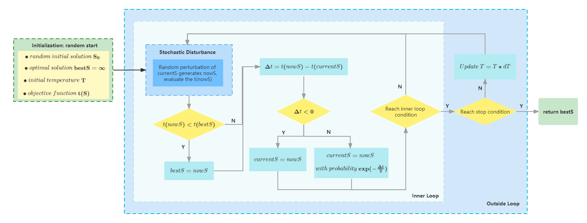
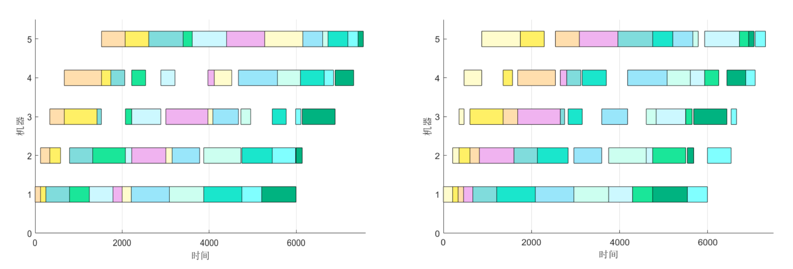
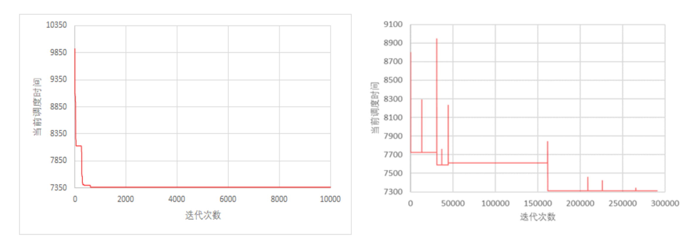

# Flow-shop-Scheduling-Problem-by-Simulated-Annealing
Solution to Flow-shop Scheduling Problem based on Simulated Annealing(SA) （BIT北理工，基于模拟退火算法的流水车间调度问题，最优化方法）

#### 流水车间调度问题

本流水车间调度问题满足以下假设。

- 同一工件不能同时在不同的机器上加工。
- 每台机器在同一时刻只能加工一个工件。
- 工件在不同机器上的加工时间是确定的。
- 工件必须按照规定的工序顺序进行加工，且所有工件的加工顺序相同。
- 每个工件在每台机器上只需加工一次，且工件在机器上的加工一旦开始后不能中断，直至完成。

#### 解题思路

本项目基于登山算法和模拟退火算法两种智能算法，以求解流水车间调度问题的最优解。登山算
法通过局部搜索更优解，通过更新迭代的方式进行深挖 (Exploration)。而模拟退火算法则增加了探索
(Exploitation) 的过程，不仅以找到最优解为目标深挖，而且有一定概率探索新的区域，这在一定程
度上解决了容易陷入局部最优的问题。实验结果表明，对于同一车间调度问题，登山算法求出的最
优解比模拟退火算法差，这也验证了探索 + 深挖的思想相比于只深挖具有更加优秀的表现。

#### 模拟退火算法流程图

#### 部分实验结果展示

1. 登山算法和模拟退火算法调度甘特图

2. 优化过程

**附**：具体项目报告详见`report.pdf`